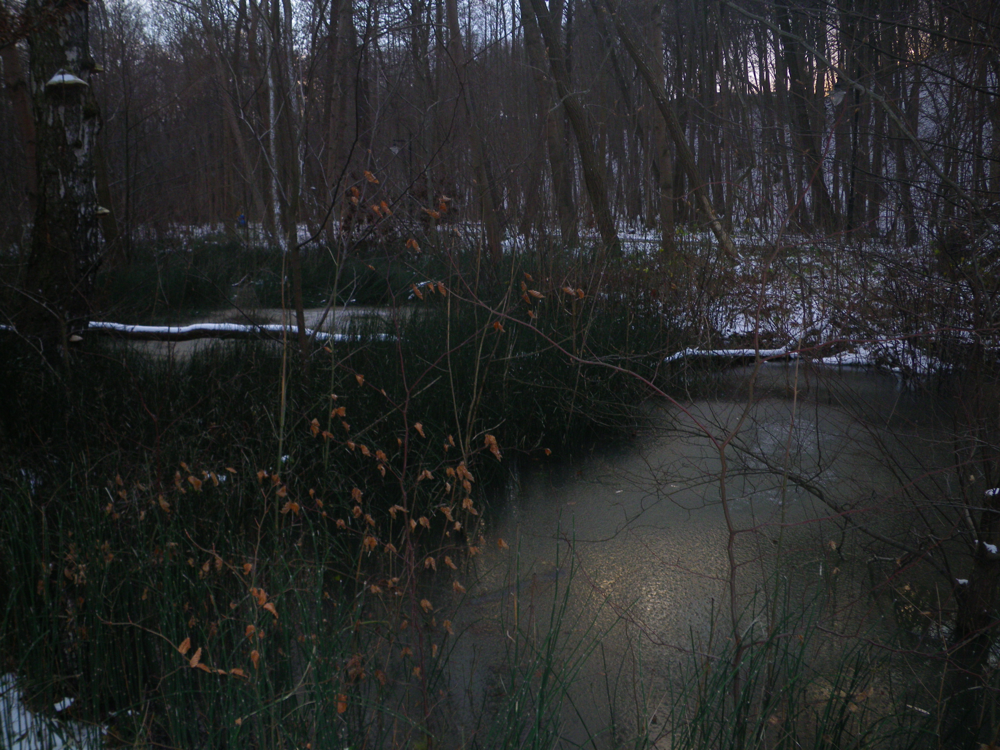
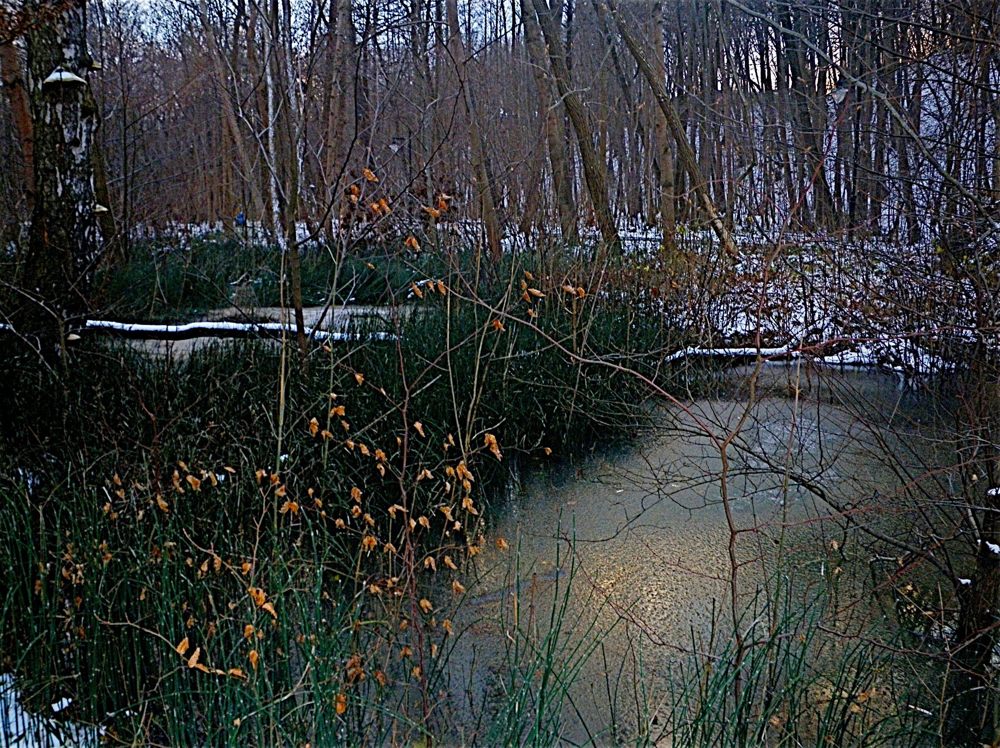
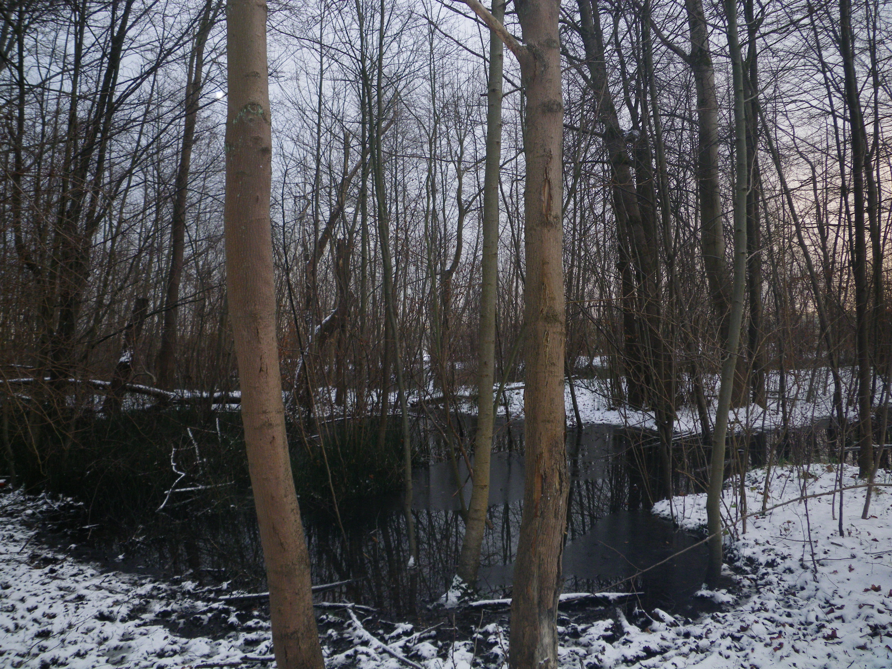
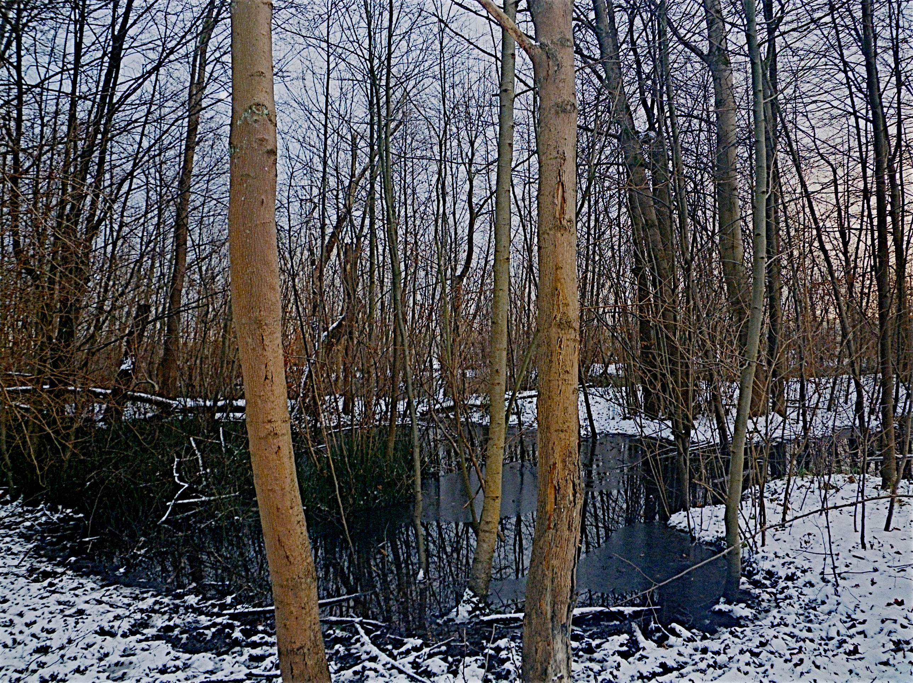
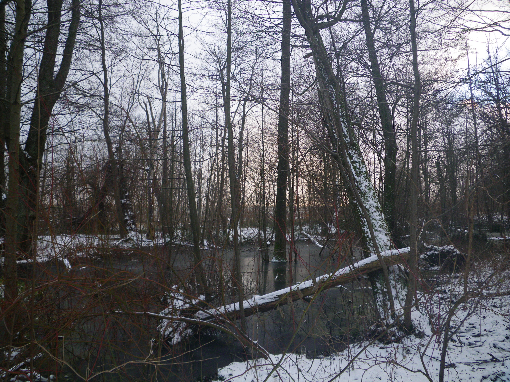

Bio Enhance
===========

Using OpenCV's [Bioinspired Module Retina](https://docs.opencv.org/3.4/d2/d94/bioinspired_retina.html) to
enhance low(er) quality photos from e.g. an old compact camera.

Requirements
------------

OpenCV 3.4.5 compiled with [Bioinspired Module Retina](https://docs.opencv.org/3.4/d2/d94/bioinspired_retina.html)
and Python bindings (installation process out of scope).

Usage
-----

Run

```sh
python bio_enhance.py
```

This will create two files: `magno.jpg` and `parvo.jpg`. Open `parvo.jpg` in GIMP.
Go to `Colors -> Brightness-Contrast Tool`. Turn `Brightness` down and
the `Contrast` up untill you like what you see :smiley:.

You should be able to turn something like this:



into this:



Or something like this:



into this:



Or something like this:


into this:


Or something like this:



into this:


The input file path is hardcoded in the script, so to use it on own images adjust this line:

```py
inputImage = cv.imread("images/input.JPG", -1)
```

TODO
----

 - [ ] add commandline parameters support ?
